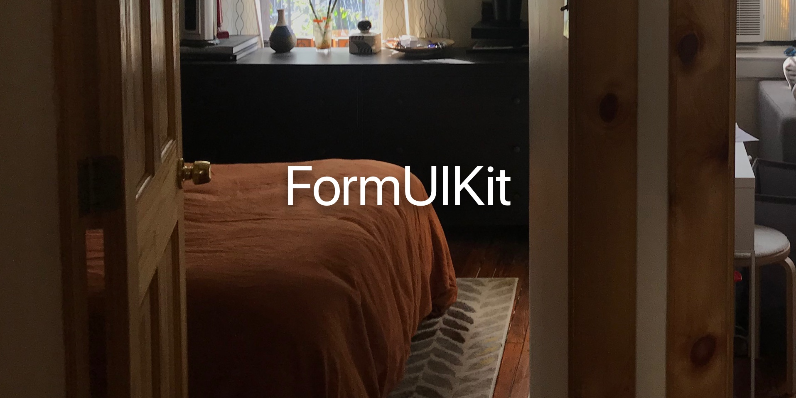

Documentation coming soon. I know there are plenty of libraries like this, and I personally came here from Eureka (which I liked, but I felt I could do a slightly better job of modeling it and keeping the API understandable.) If you need or want to use this for any reason, send me an email and I'll reply. 

Also, check out the example.
